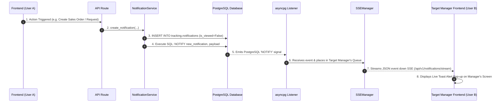

# STAR AI - Sales & Tracking Service

A lightweight, enterprise-ready microservice built with **FastAPI**, **SQLAlchemy (Async)**, and **PostgreSQL**. This service provides core functionality for **User Access Management (IAM)**, **Sales Order Processing**, **Internal Tracking (PIR/OIR/Tracker)**, and **Real-Time Live SSE Notifications**.

---

## 🚀 Key Modules Included

The codebase is organized into **4 core modules**:

1. **`approval_permission_user` (Identity & Access Management - IAM)**:
   - User account management and authentication context (`User`).
   - Physical employee master profiles (`Employee`).
   - Organizational hierarchy ranking levels 1 to 5 (`ApprovalOrder`).
   - Feature permissions (`Permissions`) and out-of-office leave delegations (`PermissionDelegation`).

2. **`sales` (Sales Order Processing)**:
   - Header & line-item sales orders (`SaleOrder`, `SaleOrderItem`).
   - Order creation, retrieval by ID, and paginated listing with Base64 keyset cursors.

3. **`tracking` (Workflow State Engine & Real-time Alerts)**:
   - **Production Item Requests (PIR)**: Manufacturing material requests.
   - **Operational Item Requests (OIR)**: IT & departmental office asset requests.
   - **Tracker & Audit Engine**: Multi-tier approval workflow state machine (`Tracker` & `TrackerHistory`).
   - **Notification & Live SSE Streaming**: Real-time push notifications via PostgreSQL `NOTIFY` and Server-Sent Events (SSE).

4. **`application_tables` (System Administration & Utilities)**:
   - Star AI Chatbot engine & query session history (`chat.py`).
   - Third-party API Key security management (`api_key.py`).
   - User Database Source connectors (`user_db_source.py`).
   - Security login audit history (`login_history.py`).

---

## 🏗️ Architecture & Project Structure

The project strictly follows a **3-Layer Architecture (Model → Repository → Service → API Route)**:

```text
star_ai_sales/
├── alembic/                         # Alembic database migration scripts
├── alembic.ini                      # Migration configuration file
└── app/
    ├── main.py                      # FastAPI application entry point (Factory pattern)
    ├── config.py                    # Pydantic environment configuration
    ├── assets/                      # Key files and environment settings (.env)
    ├── core/                        # Middleware, logging, and application lifecycle events
    ├── db/                          # Async SQLAlchemy session and database utilities
    ├── security/                    # JWT authentication and password hashing
    ├── utils/                       # SSEManager (PostgreSQL Listener & SSE broadcaster)
    ├── models/                      # SQLAlchemy Database Models
    │   ├── approval_permission_user_model/
    │   ├── sales/
    │   ├── tracking/
    │   └── application_tables/
    ├── schemas/                     # Pydantic Schemas / Request & Response DTOs
    ├── repositories/                # Database Access Layer (Async Queries & Keyset Pagination)
    ├── services/                    # Business Logic Layer
    ├── dependency/                  # FastAPI Dependency Injection (`Depends()`)
    ├── exceptions/                  # Custom Exception classes
    └── api/routes/                  # FastAPI API Endpoint Routers
        ├── approval_permission_user_routes/
        ├── sales_routes/
        ├── tracking_routes/
        └── application_table_routes/
```

---

## 🔔 Real-time Notification Sequence (PostgreSQL NOTIFY + SSE)

The application delivers live browser pop-up notifications without frontend polling:



---

## ⚙️ How to Run the Server

### 1. Prerequisites & Environment Setup
Ensure your Python virtual environment is active and dependencies are installed.

```bash
cd /home/girish/Documents/star_ai_sales
source /path/to/venv/bin/activate
```

### 2. Run Uvicorn Server (Factory Pattern)

Run the server using the Uvicorn factory flag:

```bash
uvicorn app.main:get_app --factory --reload --host 0.0.0.0 --port 8000
```

### 3. Open API Documentation
Once running, open your web browser:
- **Interactive Swagger UI**: `http://localhost:8000/docs`
- **ReDoc Documentation**: `http://localhost:8000/redoc`

---

## 📄 API Conventions & Features

- **Standard HTTP Status Codes**:
  - `POST` (Creation): **`201 Created`**
  - `GET` / `PUT` / `PATCH` / `DELETE`: **`200 OK`**
  - Errors: **`400 Bad Request`**, **`401 Unauthorized`**, **`404 Not Found`**, **`500 Internal Server Error`**.
- **Keyset Cursor Pagination**: All listing endpoints support high-performance Base64 keyset cursor pagination (`limit`, `cursor`).
